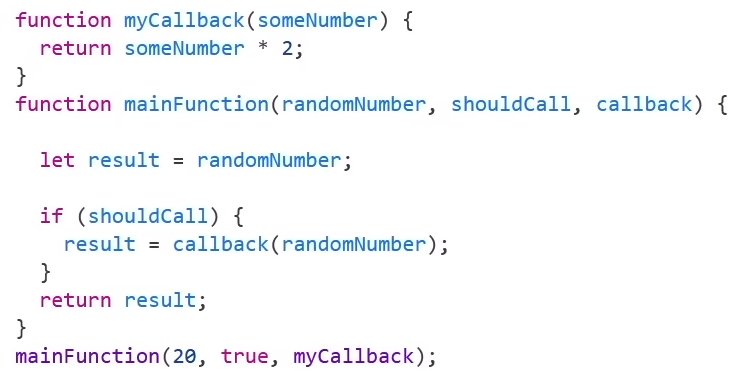
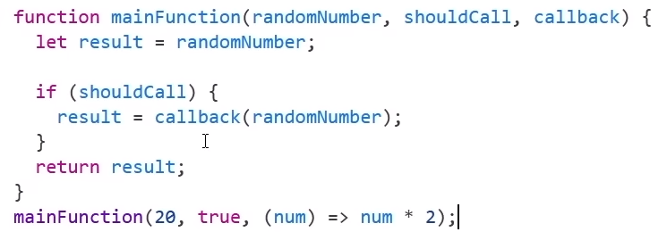
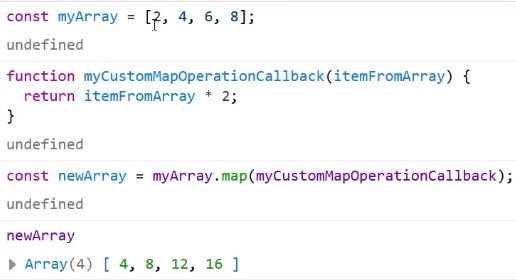
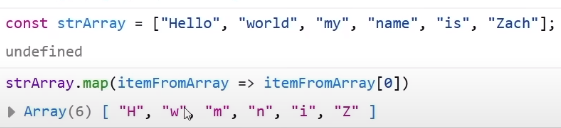
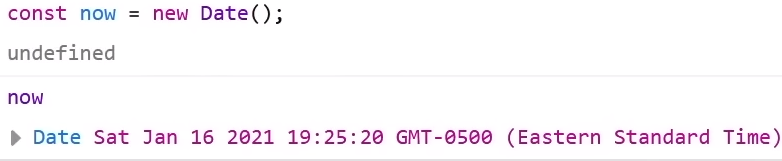
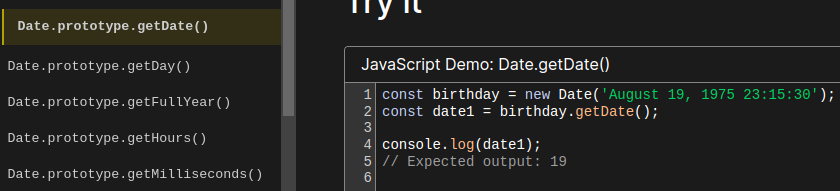
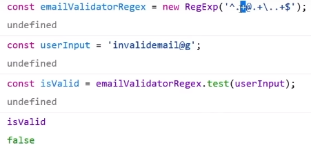

# Callback functions

| Exemplo 1 | Exemplo 2|
| ----------------------------------- | -----------------------------------
|  |  |


```js
function myCallback(someNumber){
    return someNumber *2;
}

function mainFunction (randomNumber, shouldCall, callback){
// Essa função recebe 3 argumentos
// 1º - será um valor numérico qualquer
// 2º - será um valor BOOLEAN que irá avaliar se fará a callback ou não
// 3º - será a própria callback

    let result = randomNumber; // in this exempale result == 20

    // Aqui, shouldCall é 'true', então nós alcançamos o 'callBack'
    if (shouldCall){
        // Aqui, 'callback' representa 'myCallback'. 
        // Chama a função callback pai e traz seu valor.
        result = callback (randomNumber);
    }
    // Como 'result' teve seu valor redesignado por uma callback function, return 40
    return result;
}

mainFunction(20, true, myCallback)
// Assim randomNumber = 20, e como shouldCall = True, faz o calculo de result = 20 (* 2)

/* 
mainFunction(20, true, callback(num) {
    return num * 2;
})

mainFunction(20, true, (num) => {
    return num * 2;
})

mainFunction(20, true, num => num * 2;)
*/
```

Não precisa escrever uma callback  function pai, para que realize uma callback.

- No 1º caso de cima passamos uma callback function pré-definida.
- No 2º, 3º, 4º  caso de cima passamos o valor da callback function quando a chamamos.

Seu uso é complicado, mas muito útil. Devido a possibilidade de "reuso do código" e "Asynchronous programming".

- **Reuso:** Um exemplo é o uso do método "Array Map" = faz uma callback function de cada elemento da array e retorna seu resultado após calculo.

| Exemplo 1 | Exemplo 2|
| ----------------------------------- | -----------------------------------
|  <br> |  |


- **Asynchronous programming:** é a programação utilizada para quando se trata de um código mais longo, que demora mais para rodar/ ser lido. Por isso do nome, programação fora de sincronia.
  - **Exemplo:** um website que tem um banco de dados em outro país, para que não faça o usuário ficar esperando que tudo seja carregado para utilizar o site, irá rodar o resto que for imediato enquanto carrega essa parte maior.


<br>
<br>

# JS Primitives
Quando se chama um dado com valor primitivo (str, int, float, bool ...) em JS com ele poderá realizar funções ou métodos, pois ele analisa os valores no background como objeto.


<br>
<br>

# JS Dates
Link do site com uma melhor explicação e mais detalhada [https://www.zachgollwitzer.com/posts/javascript-dates]

 <br>
Apenas irá devolver a exata data e horário do dia utilizado. Pois não passou na função/constructor ``Date()`` nenhum parâmetro ou argumento, que poderia definir melhor a data desejada.

Link para ver as possíveis utilidades do `Date() Constructor` --> [https://developer.mozilla.org/en-US/docs/Web/JavaScript/Reference/Global_Objects/Date/Date] 



**Note:** quando uma função ou construtor tiver o ÍCONE "dedo para baixo", quer dizer que não terá mais suporte e por isso seu uso não é mais recomendado.

<br>
<br>

# Regular Expressions
"
A regular expression is a sequence of characters that forms a search pattern." <br>
É basicamente um objeto que é usado para verificação/ condição para textos/ strings utilizando-se de caracteres para isso. Muito bom para ser utilizado em verificação, mas não somente isso.

- Importante nessa aula aprender como utilizar, para que serve os símbolos e ler a documentação deles para saber o modo de uso.
- Ex.: é a verificação se um e-mail adicionado no input e-mail, é um e-mail ou não.

Caracteres do `regular expression`: `(RegExp)` <br>
Oque fazem e representam (aula: 7:08:00).


- `^` = quer dizer que quer começar a leitura dessa código do começo da linha.
- `.` = que quer avaliar todos os caracteres do código.
- `+` = que quer verificar os caracteres uma ou mais de uma vez.
- `@` = que está procurando o caracter @ nessa string.
-`\` = usado para escapar das funções do caracter e prcurar por um caracter de ponto.
- `$` = fim da linha.

Podemos dividir as **Regular expressions** em duas partes, as `identifiers` e as `qualitiers`.
