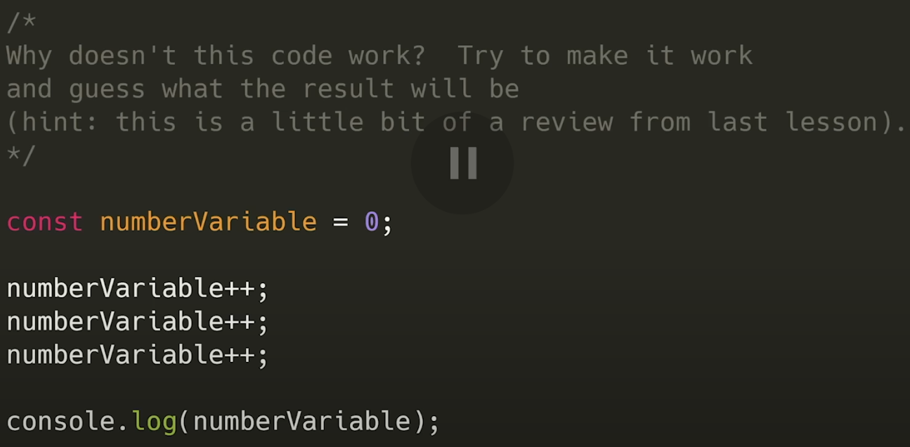
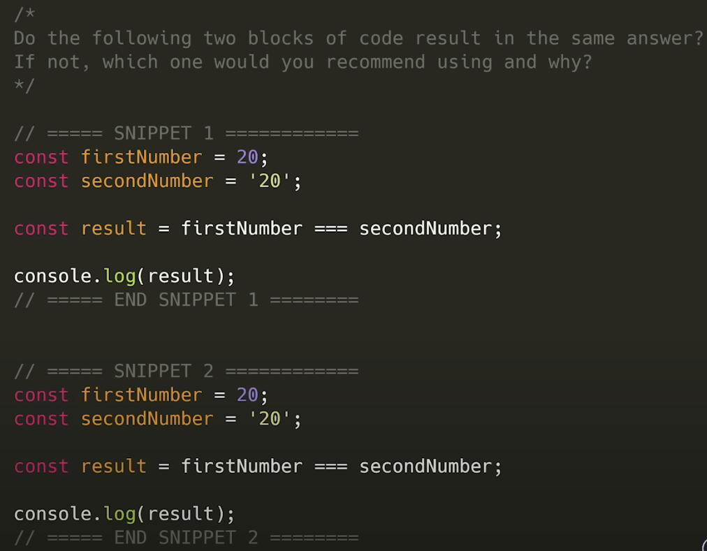
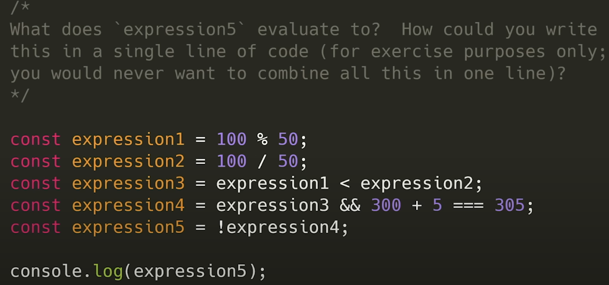
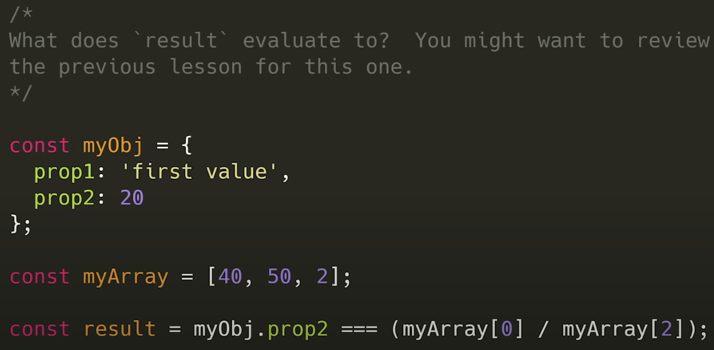
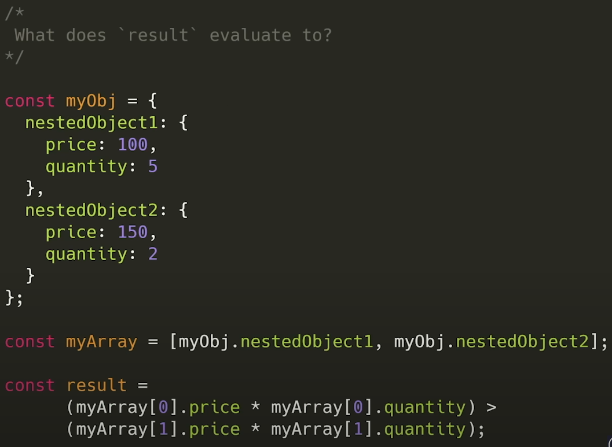

```js
== or !=    // compara apenas o valor.
=== or !== // compara o valor e tipo da variável
```

**Note:** Nem todos os valores ou tipos são comparáveis, mesmo que possuam todo seu conteúdo igual. Ex.: array e objetos.

### Ternary Operator
```js
const result = 20 === 20? 'valeus match' :  'values do not match'  --> "values match"
// Este é um jeito de escrever um código comparativo e em uma linha só. Muitos programadores usam essa forma.

// ? = ao "if"
// : = ao "else"
``` 









