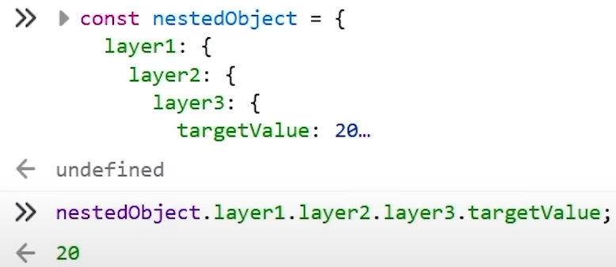

```jsx
console.log()  // print on console

// or /* */    -> comments 

var variable   // permite a redefinição dessa variável, MAS sendo de escopo     global ou local, oque pode ser alterado a qualquer momento que utilizar variável como mesmo nome sendo o motivo de não ser muito usado mais, VARIÁVEL.

const variable  // não permite que a variável seja ou não quer que seu valor    seja alterado, CONSTANTE. E somente tem valor local, dentro do bloco.

let variable    // deseja que o valor seja futuramente alterado ou que irá dar o valor posteriormente, SEJA ou VAMOS. E somente tem valor local, dentro do bloco.

parseInt()     // converte o valor da para inteiro.

parseFloat()   // converte o valor da para float.
```

**Notas:** 

- **Declarar uma variável** —> dizer que ela existe, pode ou não dar valor, reserva espaço na memória para sua existência (`let` , `const`, `var`);
- **Designar valor a uma variável** —> dar um valor a variável, int, float, string ou outros. Que pode ou não ter seu valor redefinido dependendo do tipo de declaração de variável usar (`let` , `const`, `var`)

<br>
<hr>

**JavaScript Style guide** —> https://google.github.io/styleguide/jsguide.html#naming-rules-common-to-all-identifiers

Como escrever seu código, dicas de boas maneiras e padronização de código

```jsx
const oneVariable =  20; const TwoVariable = 20;  
// Isso irá funcionar declarar várias variáveis na mesma linha. Uso do ponto e vírgula (;).

const oneVariable =  20 const TwoVariable = 20;  
// Não irá funcionar pois não  sabe o final de primeira declaração.
```

### Typeof e console.log()

```jsx
typeof variable   // irá falar o valor da variável, se é uma string, number, boolean e etc.

let variable = 10; let twoVariable = "Hello World"  --> "10Hello World"  
// quando adicionar um número a uma string irá concatenar. Irá coagir uma variável de um  tipo a se somar a de outro tipo.

console.log(`O número ${variable} e a frase ${twoVariable}`) 

or

console.log("O número +variable+ e a frase +twoVariable+") --> "O número 10 e a frase hello world"  
// o uso da crase OU o sinal de + + é igual o print (f " ")
```

### Array

```jsx
const firsArray = [10,20,30,40];  // array usa [  ]

const secondArray =  [10, 'a string', {prop: 'object'}, [1,2,3] ] 
// pode mistu-rar o tipo de os tipos de dados dentro de uma array


console.log(firstArray[1])

console.log(secondArray[3] [0]) --> 1  
// pode extrair valores de nested arrays
```

### Object

```jsx
const objectVariable = {prop1: 20, prop2: 50 }; --> Object {prop1: 20, prop2: 50 }  
// o "prop" é a chave/ propriedade e depois vem o valor. Deve se separar as partes com uso da vírgula (,).
// Objeto é igual a dicionário no python.
```

